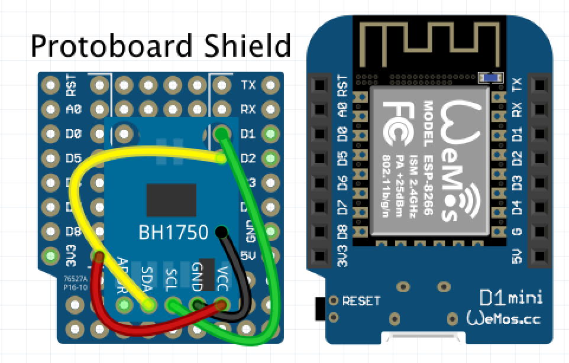

# Sensor Wemos D1 mini with BH-1750

This firmware is meant to be used on a Wemos D1. It's part of the [IoT Kit for education](https://www.iot-kit.nl) project.
It is based on the homie platform developed by Marvin Roger.
The original documentation can be found here: [http://marvinroger.github.io/homie-esp8266/](http://marvinroger.github.io/homie-esp8266/)

This node serves as a sensor that reports distance via MQTT. The sensor used is a BH-1750.

## Connecting the hardware
Connect the hardware as follows:

| BH-1750 |  Wemos D1 mini |
| --- | ---|
| VCC |+3.3V |
| GND | GND |
| SCL | D1 |
| SDA | D2 |

See the following image how to make your own using a standard prototyping shield. All the colored wires are soldered on the back of the shield.


## Compiling and uploading
This firmware embeds the ui_bundle to make the initial configuration easier.
In order to upload it into the SPIFFS filesystem you have to build the firmware first and then open up a terminal.

In the terminal enter the command `pio run -t uploadfs` to upload the contents of the /data directory.
Once the upload has completed upload the firmware as usual or type the command `pio run -t upload`.

It is also possible to include a file `config.json` in the directorie /data/homie with preconfigured settings before you upload the files to SPIFFS e.g.:
```
{
  "wifi":{
    "ssid":"<SSID>",
    "password": "<PASSWWORD>"
    },
  "mqtt":{
    "host":"mqtt.example.com",
    "port":1883,
    "base_topic":"devices/",
    "username": "<mqtt username>",
    "password": "<mqtt password>",
    "auth":true
  },
  "name":"Sensor X",
  "ota":{
    "enabled":true
    },
  "device_id":"wemos-x"
}
```
For MQTT you can ommit `username`, `password` and `auth` if your MQTT server doesn't requite authentication.

If you ommit `base_topic` it will default to the value "homie"

## MQTT
If all is configured well you should receive measurements on the following topics:
```
<base_topic>/<device_id>/light/light
<base_topic>/<device_id>/light/dusk
<base_topic>/<device_id>/distance/json
```
The json output contains the name of the sensor, the name of the metric reported and the value of the measurement.
dusk is a value 0 or 1 that's telling us if we're in dusk or not.
